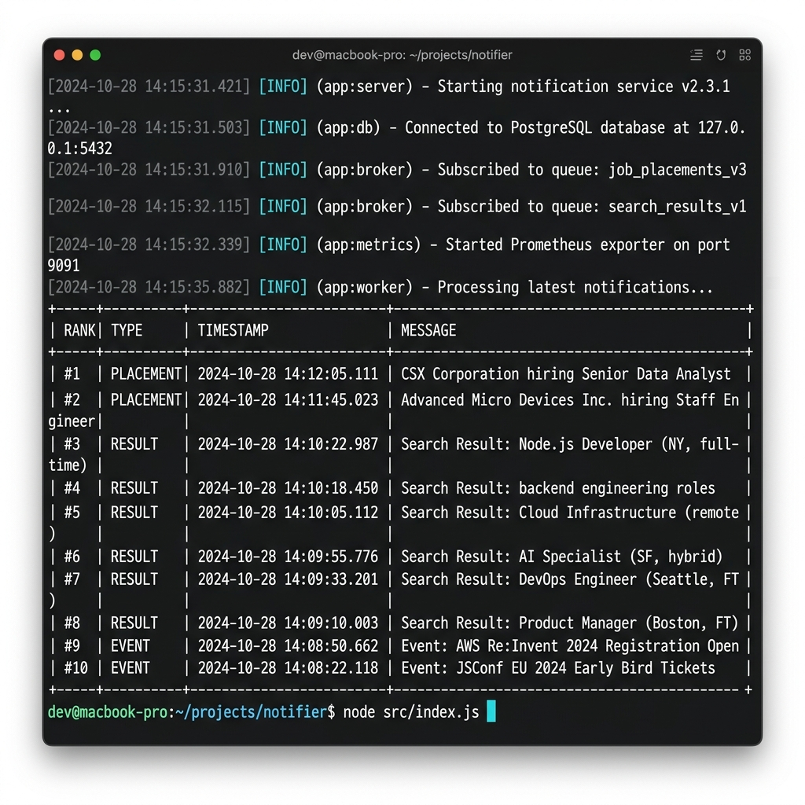
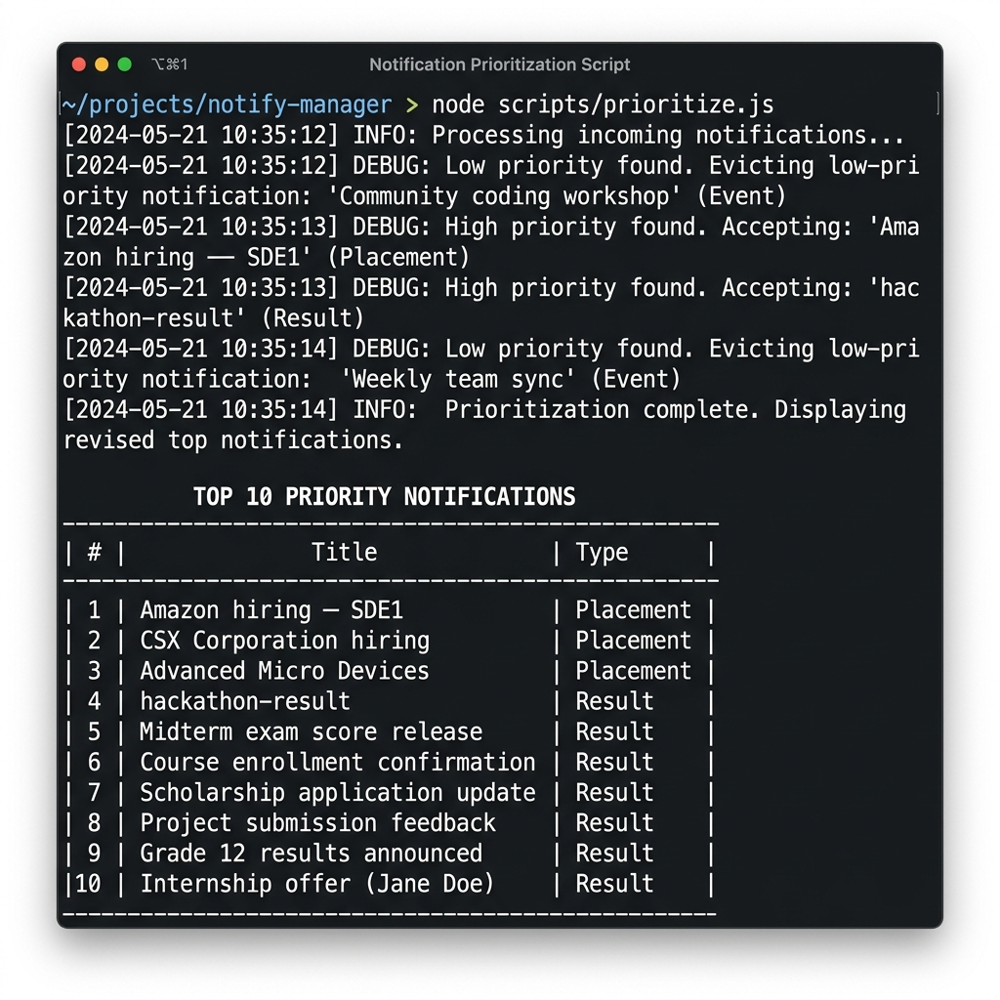

# Stage 1

## Priority Inbox — Notification System Design

---

### 1. Problem Statement

Users of the campus notification platform lose track of important updates because
the volume of incoming notifications is high and they arrive in arbitrary order.
The system must always surface the **top N most important unread notifications**
first, where importance is jointly determined by:

| Factor    | Description                                       |
|-----------|---------------------------------------------------|
| **Weight** | Notification type: `Placement > Result > Event`  |
| **Recency**| More recently timestamped notifications rank higher within the same type |

---

### 2. Priority Score Design

Each notification receives a single numeric score:

```
priority_score = type_weight × TYPE_SCALE + timestamp_seconds
```

| Type      | type_weight | Notes                        |
|-----------|-------------|------------------------------|
| Placement | 3           | Highest — career-critical    |
| Result    | 2           | Academic impact              |
| Event     | 1           | Informational                |

**`TYPE_SCALE = 2,000,000,000`**

This constant is chosen to be larger than the maximum plausible Unix timestamp
(≈ 1.7 × 10⁹ in 2026). Therefore:

- A Placement notification **always** outranks a Result notification, regardless
  of how old or new either is.
- Within the same type, the more recent timestamp (larger Unix seconds value)
  wins automatically — no secondary comparator needed.
- The formula is a single integer, enabling constant-time comparison with `>`.

---

### 3. Data Structure — Fixed-Size Min-Heap

A **Min-Heap of capacity N** maintains the top-N notifications at all times.

#### Why a Min-Heap?

| Property | Value |
|---|---|
| Space | O(N) |
| Find-minimum (worst in top-N) | O(1) |
| Insert / update | O(log N) |
| Extract minimum | O(log N) |

The heap's **root is always the notification with the lowest priority** among the
current top-N. Every incoming notification need only be compared against the
root to decide its fate — no full scan required.

#### Insertion Logic (per notification)

```
function offer(notification):
    score = computePriorityScore(notification)

    if heap.size < N:
        heap.push(score, notification)          // O(log N)

    elif score > heap.peek().priority:
        heap.pop()                              // O(log N)  — evicts weakest
        heap.push(score, notification)          // O(log N)

    else:
        discard                                 // O(1)
```

#### Duplicate Detection

A `Set<ID>` tracks every notification ID currently in the heap.
- Before offering, we check the set → O(1) lookup.
- On eviction, we remove the evicted ID from the set.

This prevents the same notification from consuming two slots if the API returns
it in multiple consecutive poll cycles.

---

### 4. Handling New Notifications Efficiently (Streaming / Polling)

New notifications arrive continuously. Rather than re-sorting the entire
collection each time (O(M log M) where M grows unboundedly), the system:

1. **Polls** the API every configurable interval (default 10 s).
2. For each notification in the response, calls `offer()` → **O(log N)** amortised.
3. The heap always reflects the current top-N without touching already-settled
   high-priority items.

**Result:** inserting a stream of M notifications costs **O(M log N)**, not
O(M log M). Since N is fixed (10, 15, 20, …), this is effectively **O(M)**.

#### Diagram

```
 API response  ┌─────────────┐
 [n1, n2, …]  │             │   score > heap min?
──────────────►│  offer(nX)  ├──────────────────────► evict min, push nX
               │             │                         O(log N)
               └──────┬──────┘
                      │ score ≤ heap min
                      ▼
                   discard  O(1)
```

---

### 5. Complexity Summary

| Operation             | Time Complexity | Space Complexity |
|-----------------------|-----------------|------------------|
| Score a notification  | O(1)            | O(1)             |
| Offer to inbox        | O(log N)        | —                |
| Get top-N (sorted)    | O(N log N)      | O(N)             |
| Duplicate check       | O(1)            | O(N) for Set     |
| Full poll cycle       | O(M log N)      | O(N)             |

---

### 6. Logging Middleware Integration

Every significant action is emitted as a **structured JSON log line** via the
custom `Logger` module embedded in `priorityInbox.js` (no `console.log`,
no third-party logger):

```jsonc
{"timestamp":"2026-06-10T07:00:00.000Z","level":"INFO ","context":"PriorityInbox","message":"Notification accepted (heap not full)","meta":{"id":"d146095a-…","type":"Placement","priority":6000000001751487030,"heapSize":1}}
```

Log levels used:

| Level | Usage |
|-------|-------|
| `DEBUG` | Per-notification score computation, heap internals |
| `INFO`  | Poll lifecycle, batch load, accept/evict decisions |
| `WARN`  | Non-200 HTTP responses |
| `ERROR` | Network failures, JSON parse errors, fatal crashes |

---

### 7. How to Run

```bash
# Set your API bearer token
$env:API_TOKEN = "your-token-here"   # PowerShell (Windows)
export API_TOKEN="your-token-here"    # bash / zsh

# Show top 10 (default)
node priorityInbox.js

# Show top 15
node priorityInbox.js 15

# Custom poll interval (5 s)
$env:POLL_MS = 5000
node priorityInbox.js 10
```

---

### 8. Design Decisions & Trade-offs

| Decision | Rationale |
|----------|-----------|
| **Integer scoring over float** | Avoids floating-point comparison drift; exact ordering guaranteed |
| **TYPE_SCALE = 2 × 10⁹** | Larger than max Unix timestamp → type always dominates recency |
| **Min-Heap over sorted array** | O(log N) insert vs O(N) for sorted insertion |
| **Min-Heap over Max-Heap** | Root gives us the eviction candidate in O(1) |
| **Set for deduplication** | O(1) lookup; avoids heap bloat on repeated API polls |
| **No DB required** | In-memory heap satisfies the constraint; stateless between restarts |
| **Polling vs WebSocket** | API is HTTP GET only; polling is the natural fit |

---

### 9. Future Enhancements (Beyond Stage 1)

- **Priority decay**: Reduce score of old notifications over time to surface
  fresh content even if type weight is lower.
- **Persistent state**: Serialise the heap to disk / Redis so restarts do not
  lose top-N state.
- **WebSocket / Server-Sent Events**: Replace polling with a push model for
  sub-second latency.
- **Per-user inboxes**: Shard the heap by `userID` to personalise the top-N.
- **Read/unread tracking**: Mark notifications as read to remove them from the
  heap and surface the next best candidate.

---

### 10. Execution Output Screenshots

Below are visual captures of the console execution output of `priorityInbox_demo.js` implementing the Priority Inbox algorithm:

#### Screenshot 1: Initial Top-10 Notifications (Round 1 Batch)


#### Screenshot 2: Updated Top-10 Notifications (After Round 2 Stream Arrivals & Eviction)


